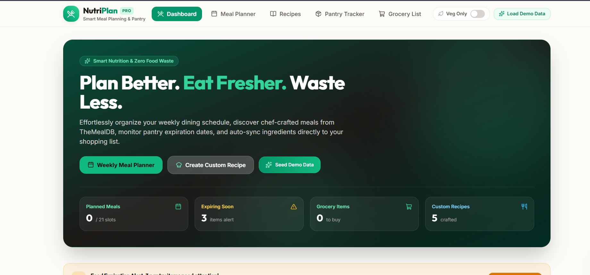
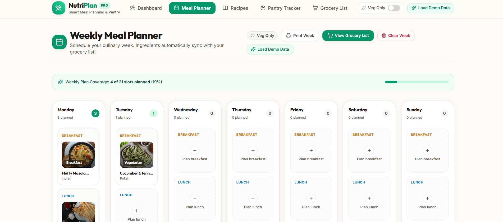
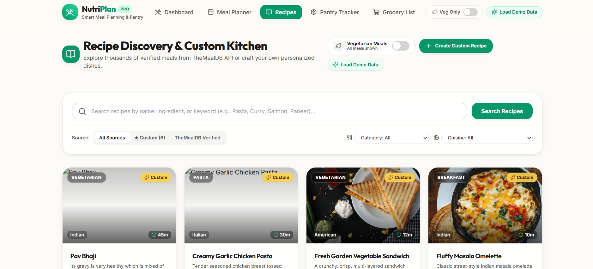
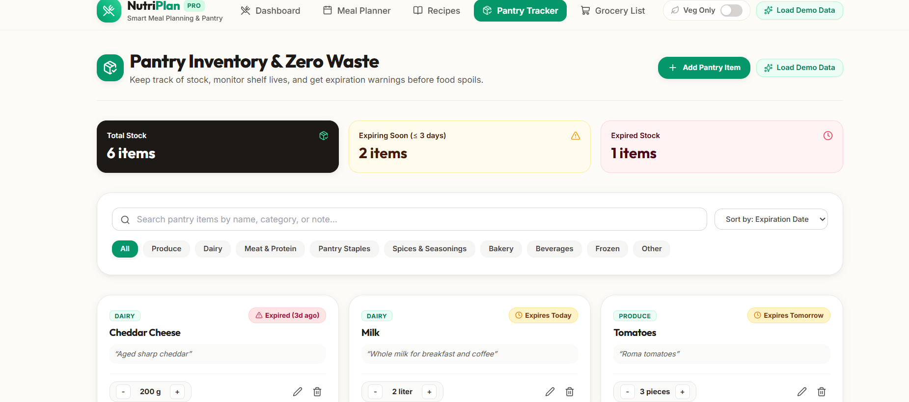
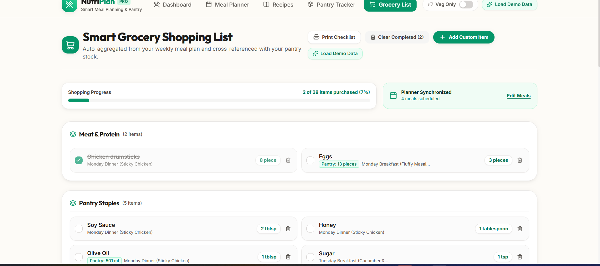
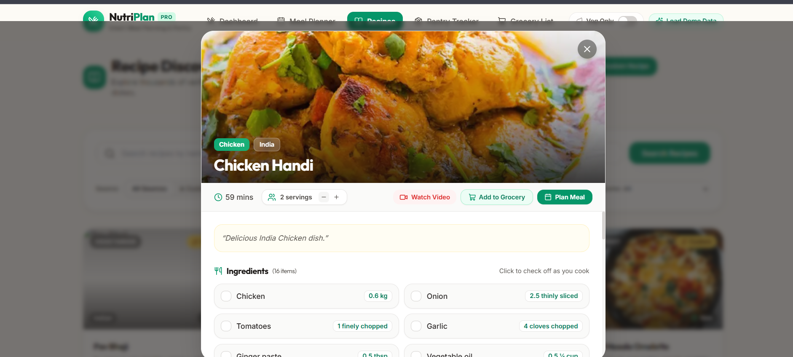

# NutriPlan

NutriPlan is a full-stack meal planning, recipe management, and pantry tracking application built with Next.js 14, TypeScript, Tailwind CSS, and MongoDB.

It connects weekly meal scheduling with recipe discovery, shelf-life monitoring to prevent food waste, and automated grocery list generation that cross-references on-hand pantry stock.

---

## Demo & Screenshots

### 📹 Demo Video

https://youtu.be/6VLfwU_mgCg

### 📸 Application Screenshots

| **Dashboard Overview** | **Weekly Meal Planner** |
|:---:|:---:|
|  |  |

| **Recipe Discovery & Kitchen** | **Pantry & Shelf-Life Tracker** |
|:---:|:---:|
|  |  |

| **Automated Grocery List** | **Recipe Details & Cooking Modal** |
|:---:|:---:|
|  |  |

---

## Core Features

### 1. Weekly Meal Planner
- **Full Weekly Schedule**: Organizes meals across 7 days (Monday through Sunday) with 3 slots per day (Breakfast, Lunch, Dinner), totaling 21 customizable slots.
- **Recipe Assignment**: Assign recipes directly from TheMealDB search or from your saved custom recipes through an interactive modal.
- **Slot Notes**: Attach custom preparation reminders to any slot (e.g., marinate overnight, prep lunchbox).
- **Print Optimization**: Built-in print layout stylesheet (`@media print`) that formats the entire weekly schedule cleanly onto standard paper.
- **Planner Actions**: Supports clearing individual slots or performing a full weekly reset.

### 2. Recipe Discovery & Custom Kitchen
- **TheMealDB Integration**: Search meals by keyword, category (e.g., Pasta, Seafood, Dessert), cuisine region (e.g., Italian, Mexican, Indian), or main ingredient.
- **Custom Recipe Creator**: Create custom dishes with dynamic ingredient rows (amount, unit, name), step-by-step instructions, prep times, servings, and notes.
- **Serving Scaler**: Dynamically scales ingredient amounts up or down based on the selected serving count.
- **Interactive Cooking Checklist**: Tick off ingredients as you prep or cook directly inside the recipe modal.
- **Video Tutorials**: Displays embedded YouTube cooking tutorial links when provided by TheMealDB.
- **Direct Grocery Export**: Add ingredients from any recipe straight to your grocery shopping list with one click.

### 3. Vegetarian Preference (Veg Only Mode)
- **Top Navigation Toggle**: Switch between viewing all meals or filtering exclusively for vegetarian dishes.
- **Global Context & Persistence**: Toggling the preference saves to `localStorage` and immediately updates recipe discovery, dashboard inspiration grids, and meal scheduling modals across the entire app.
- **Ingredient & Metadata Classification**: Evaluates recipe category tags, titles, and ingredient lists against non-vegetarian keywords (poultry, beef, pork, seafood, etc.) to accurately filter results.

### 4. Pantry & Shelf-Life Tracker
- **Expiration Monitoring**: Automatically computes item freshness based on expiration dates:
  - **Fresh**: Items with more than 3 days of remaining shelf life.
  - **Expiring Soon**: Items expiring within the next 72 hours.
  - **Expired**: Items past their expiration date.
- **Quantity Stepper**: Adjust quantities on the fly with card-level `+` and `-` controls.
- **Department Categorization**: Automatically categorizes ingredients into Produce, Dairy, Meat & Seafood, Bakery, Pantry Staples, and Spices.
- **Filtering & Sorting**: Filter items by department or expiration status, and sort by expiry date.

### 5. Automated Grocery List
- **Weekly Plan Sync**: Automatically extracts and compiles all required ingredients from your scheduled meals.
- **Pantry Cross-Referencing**: Checks each grocery item against current pantry stock and displays the on-hand quantity, preventing accidental duplicate purchases.
- **Department Grouping**: Groups shopping items by store aisles to streamline in-store shopping.
- **Checklist & Progress Tracking**: Check off purchased items with real-time progress indicators.
- **Custom Items**: Add one-off grocery items not tied to a specific meal plan.
- **Batch Management**: Clear purchased items or reset the entire list in one click.

---

## Tech Stack

| Component | Technology | Description |
|---|---|---|
| **Framework** | Next.js 14 | App Router, Server Components, and API Route Handlers |
| **Language** | TypeScript | Strict type safety with shared interfaces across client and API |
| **Styling** | Tailwind CSS | Utility-first CSS with custom color palette and responsive layouts |
| **Database** | MongoDB | Document database connected via Mongoose ODM |
| **Icons** | Lucide React | Clean, consistent UI iconography |
| **Recipe API** | TheMealDB | Public REST API for global recipe searches |

---

## Architecture & Data Flow

```text
               ┌───────────────────────┐
               │    TheMealDB API      │
               └──────────┬────────────┘
                          │ (external recipes)
                          ▼
┌─────────────────────────────────────────────────────────────┐
│                       Next.js App                           │
│                                                             │
│   ┌───────────────┐     ┌───────────────┐   ┌───────────┐   │
│   │ Weekly Plan   │◄───►│ Grocery List  │◄──┤  Pantry   │   │
│   └───────┬───────┘     └───────────────┘   └─────┬─────┘   │
│           │                                       │         │
│           └─────────────────┬─────────────────────┘         │
└─────────────────────────────┼───────────────────────────────┘
                              ▼
               ┌───────────────────────┐
               │   MongoDB Database    │
               │ (Plans, Pantry, Cust) │
               └───────────────────────┘
```

1. **Meal Planning**: The user assigns recipes (custom or API) to weekday slots in `MealPlan`.
2. **Pantry Tracking**: User manages stock in `PantryItem` with expiration dates.
3. **Grocery Generation**: When loading `/grocery`, the server/client parses scheduled recipes, aggregates ingredients, compares them to `PantryItem` stock, and populates `GroceryItem`.

---

## Project Structure

```text
├── app/
│   ├── api/
│   │   ├── grocery/              # Grocery list CRUD and pantry cross-referencing
│   │   │   └── [id]/             # Single item toggle / delete
│   │   ├── meal-plan/            # Weekly meal planner endpoints
│   │   │   └── [id]/             # Single slot operations
│   │   ├── pantry/               # Pantry inventory endpoints
│   │   │   └── [id]/             # Pantry item update / delete
│   │   ├── recipes/              # Custom recipe management
│   │   │   └── [id]/             # Single recipe fetch / update / delete
│   │   └── seed/                 # Database seeder endpoint
│   ├── grocery/                  # Grocery checklist page
│   ├── pantry/                   # Pantry & expiration tracker page
│   ├── planner/                  # Weekly meal planner page
│   ├── recipes/                  # Recipe discovery and custom kitchen
│   ├── layout.tsx                # Root layout, providers, navbar, footer
│   └── page.tsx                  # Dashboard with summary widgets
├── components/
│   ├── grocery/                  # AddGroceryModal and item cards
│   ├── pantry/                   # PantryItemModal and status badges
│   ├── planner/                  # MealSlotModal and calendar grid
│   ├── recipes/                  # RecipeCard, RecipeModal, RecipeFormModal
│   ├── ui/                       # Toast notifications and reusable elements
│   ├── Navbar.tsx                # Navigation header with Veg Only toggle
│   ├── Footer.tsx                # Application footer
│   └── VegToggle.tsx             # Vegetarian filter toggle switch
├── context/
│   └── VegPreferenceContext.tsx  # React context for global veg filter
├── lib/
│   ├── mongodb.ts                # Cached Mongoose connection handler
│   ├── sampleData.ts             # Predefined demo recipes and pantry items
│   ├── themealdb.ts              # TheMealDB API client and data normalizer
│   └── utils.ts                  # Date formatting, shelf-life logic, unit parsing
├── models/
│   ├── GroceryItem.ts            # Mongoose schema for grocery items
│   ├── MealPlan.ts               # Mongoose schema for scheduled slots
│   ├── PantryItem.ts             # Mongoose schema for pantry stock
│   └── Recipe.ts                 # Mongoose schema for custom recipes
├── services/                     # Client-side API fetch abstraction layer
└── types/                        # TypeScript interfaces (IRecipe, IMealPlan, etc.)
```

---

## API Endpoints

### Recipes (`/api/recipes`)
- `GET /api/recipes`: List custom recipes (supports query params `?search=`, `?category=`, `?cuisine=`).
- `POST /api/recipes`: Create a new custom recipe.
- `GET /api/recipes/:id`: Retrieve details for a specific custom recipe.
- `PUT /api/recipes/:id`: Update an existing custom recipe.
- `DELETE /api/recipes/:id`: Delete a custom recipe.

### Meal Plans (`/api/meal-plan`)
- `GET /api/meal-plan`: Retrieve all scheduled meal slots for the week.
- `POST /api/meal-plan`: Assign or update a meal slot (`dayOfWeek`, `mealType`, `recipeId` or `externalMeal`).
- `DELETE /api/meal-plan`: Clear all meal plan slots for the week.
- `DELETE /api/meal-plan/:id`: Remove a single meal slot by ID.

### Pantry (`/api/pantry`)
- `GET /api/pantry`: List all pantry inventory items with expiration metadata.
- `POST /api/pantry`: Add a new item (`name`, `quantity`, `unit`, `expirationDate`, `category`).
- `PUT /api/pantry/:id`: Update pantry item details or adjust quantities.
- `DELETE /api/pantry/:id`: Remove an item from the pantry.

### Grocery List (`/api/grocery`)
- `GET /api/grocery`: Fetch the aggregated grocery list cross-referenced with pantry stock.
- `POST /api/grocery`: Add a custom grocery item or batch-add recipe ingredients.
- `PUT /api/grocery/:id`: Toggle the purchased status of an item.
- `DELETE /api/grocery`: Clear items (supports `?completedOnly=true`).
- `DELETE /api/grocery/:id`: Remove an individual grocery item.

### Seed (`/api/seed`)
- `POST /api/seed`: Reset and reseed the database with demo recipes, pantry stock, and meal plans.

---

## Getting Started

### Prerequisites
- **Node.js**: v18.17.0 or higher
- **MongoDB**: Local MongoDB instance (`mongodb://127.0.0.1:27017`) or a [MongoDB Atlas](https://www.mongodb.com/atlas) connection URI

### Installation & Configuration

1. **Clone the repository**:
   ```bash
   git clone <repository-url>
   cd "Nutri club recr"
   npm install
   ```

2. **Environment Variables**:
   Create a `.env.local` file in the project root:
   ```env
   MONGODB_URI=mongodb://127.0.0.1:27017/nutriplan
   NEXT_PUBLIC_APP_URL=http://localhost:3000
   ```

3. **Populate Sample Data**:
   You can populate the database with initial recipes, pantry items, and scheduled meals using:
   - **Web UI**: Click the **"Load Demo Data"** button in the navigation header.
   - **Terminal**:
     ```bash
     npm run seed
     ```

4. **Run the Development Server**:
   ```bash
   npm run dev
   ```
   Open [http://localhost:3000](http://localhost:3000) in your browser.

---

## Available Scripts

| Script | Purpose |
|---|---|
| `npm run dev` | Starts the Next.js development server on port 3000 |
| `npm run build` | Compiles and builds the production application |
| `npm start` | Runs the compiled production server |
| `npm run lint` | Runs ESLint across the codebase |
| `npm run seed` | Runs the standalone database seeding script (`scripts/seed.js`) |

---

## License

This project is licensed under the MIT License.
